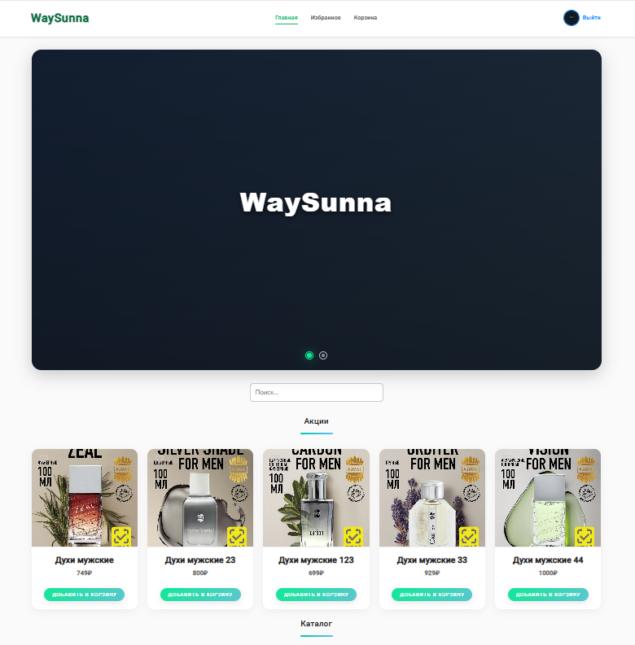

<div align="center">

  <br />

  <a href="https://github.com/spector323" target="_blank">
    
  </a>

  <br />

  <h1>Perfume Haven (Учебная версия)</h1>

  <p align="center">
    Ваш идеальный онлайн-магазин духов с уникальными фишками! Откройте мир ароматов.
  </p>

  <p align="center">
    
    
    
    
    
  </p>

  <p align="center">
    <a href="https://github.com/magasov/autoru/issues">Отчеты об ошибках</a> •
    <a href="https://github.com/magasov/autoru/pulls">Предложить улучшение</a>
  </p>

</div>

---

## 🌸 О проекте

**Perfume Haven** — это неофициальная учебная версия интернет-магазина духов, созданная для практики fullstack-разработки. Проект не связан с реальными брендами или коммерческими платформами и предназначен исключительно для образовательных целей. Здесь вы найдете каталог изысканных ароматов, удобную корзину и возможность сохранять любимые духи в избранное. Погрузитесь в мир парфюмерии с современным интерфейсом и функциональностью!

---

## 🚀 Что реализовано

| Функция                  | Описание                                      |
|--------------------------|-----------------------------------------------|
| 🌟 Каталог ароматов      | Просмотр духов по категориям (например, цветочные, древесные) |
| 🛒 Корзина               | Добавление, изменение количества и удаление духов |
| ⭐ Избранное             | Сохранение любимых ароматов с быстрым доступом |
| ➕🗑️ Управление товарами | Добавление и удаление духов (для администраторов) |
| 🔢 Подсчет просмотров    | Отслеживание популярности ароматов            |
| 🔒 Вход с подтверждением | Регистрация и вход по почте с кодом           |
| 🔔 Email-уведомления     | Уведомления о статусе заказа или новинках     |
| 🎞 Слайдеры изображений  | Адаптивные слайдеры для отображения флаконов  |
| 🏷️ Мета-теги            | Оптимизация SEO для поиска ароматов           |

---

## 📋 Технологический стек

### 🧩 Frontend (Angular)
- 🅰️ **Angular 19** — фреймворк для создания интерактивного интерфейса.
- 🌐 **Angular Router** — навигация по категориям и товарам.
- 🎭 **Ngx Emoji Mart + emoji-picker-element** — поддержка эмодзи (например, для отзывов).
- 📡 **Axios** — запросы к API.
- 🔔 **Ngx Sonner** — стильные уведомления.
- 🔊 **Socket.IO Client** — реальное время (например, для обновлений корзины).
- 🧠 **RxJS** — реактивное управление данными.
- 🧪 **Jasmine + Karma** — тестирование.

### ⚙️ Backend (Node.js + Express)
- 🚂 **Express.js** — серверная логика.
- 💾 **MongoDB + Mongoose** — база данных для хранения товаров и пользователей.
- 🔐 **JWT (jsonwebtoken)** — безопасная аутентификация.
- 🛡 **Express Rate Limit** — защита от ботов.
- 📩 **Nodemailer** — отправка email (например, подтверждение заказа).
- 🧱 **Multer** — загрузка изображений флаконов.
- 🔄 **Nodemon** — автоматическая перезагрузка.
- 🧂 **bcrypt** — хеширование паролей.
- 🔌 **Socket.IO** — реальное время.
- 🆔 **UUID** — уникальные идентификаторы.
- 🌍 **CORS + dotenv** — настройка окружения.

---

## 🚀 Как начать

### Предварительные требования
- Установите [Node.js](https://nodejs.org/) (версия 18.x или выше).
- Установите [Angular CLI](https://angular.io/cli) (`npm install -g @angular/cli`).
- Настройте [MongoDB](https://www.mongodb.com/) (локально или через MongoDB Atlas).

### Пошаговая инструкция

1. **Склонируйте репозиторий**
   ```bash
   git clone https://github.com/Spector323/WaySunna.git
   cd front
   ```

2. **Настройте переменные окружения**
   В корне папки `api` создайте файл `.env` и добавьте следующие переменные (замените на свои значения):
   ```env
   JWT_SECRET=ваш_секретный_ключ_для_JWT
   EMAIL_USER=ваш_электронный_адрес_для_отправки_писем
   EMAIL_PASS=пароль_приложения_от_гугл (см. ниже для генерации)
   MONGO_URI=ваша_строка_подключения_к_MongoDB
   PORT=8080
   CLIENT_URL=http://localhost:4200
   ```

3. **Установите зависимости**
   - Для бэкенда:
     ```bash
     cd server
     npm install
     ```
   - Для фронтенда:
     ```bash
     cd ../front
     npm install
     ```

4. **Запустите проект**
   - Запустите бэкенд (в одном терминале):
     ```bash
     cd server
     npm run dev
     ```
   - Запустите фронтенд (в другом терминале):
     ```bash
     cd ../front
     npm start
     ```

5. **Откройте в браузере**
   Перейдите по адресу: [http://localhost:4200](http://localhost:4200)

---

## 🌐 API Endpoints (примеры)

### Аутентификация
- `POST /api/auth/register` — Регистрация с подтверждением.
- `POST /api/auth/login` — Вход в систему.
- `GET /api/auth/profile` — Информация о пользователе.

### Товары (духи)
- `GET /api/products` — Список духов.
- `POST /api/products` — Добавление аромата (Admin).
- `PUT /api/products/:id` — Обновление аромата.
- `DELETE /api/products/:id` — Удаление аромата.

### Корзина
- `GET /api/basket` — Просмотр корзины.
- `POST /api/basket/add` — Добавление духов.
- `POST /api/basket/update` — Изменение количества.
- `POST /api/basket/remove/:id` — Удаление из корзины.

---

## 🖼️ Скриншоты

| Каталог духов            | Корзина ароматов        | Избранное               |
|--------------------------|-------------------------|-------------------------|
|  |  |  |

*(Добавь свои скриншоты в папку `screenshots/` и обнови пути)*

---

## 📜 Лицензия

Проект распространяется под [MIT License](LICENSE). Используйте только в учебных целях.

---

## 🤝 Вклад в проект

Приветствуем ваш вклад! Следуйте этим шагам:
1. Сделайте форк репозитория.
2. Создайте ветку: `git checkout -b feature/название-фичи`.
3. Сделайте коммиты: `git commit -m "Добавил новую фичу"`.
4. Отправьте изменения: `git push origin feature/название-фичи`.
5. Откройте Pull Request.

---

## 📧 Контакты

- Автор: [Spector323](https://github.com/Spector323)
- Email: [amiraldiev752@gmail.com](mailto:amiraldiev752@gmail.com)
- Создавайте [issues](https://github.com/Spector323/WaySunna/issues) для вопросов.

---
